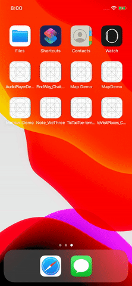
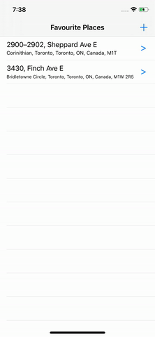
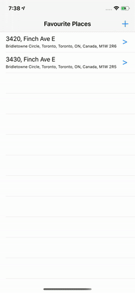
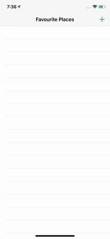
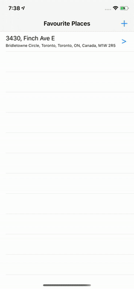
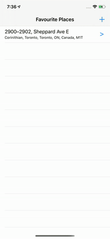
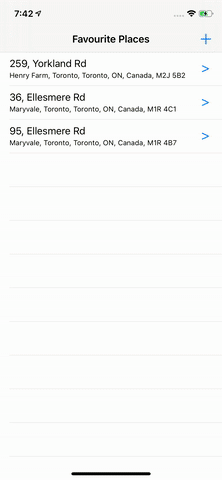
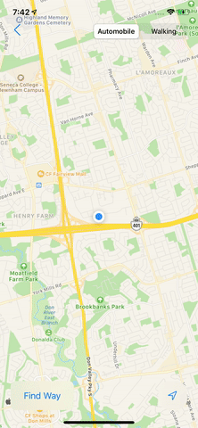
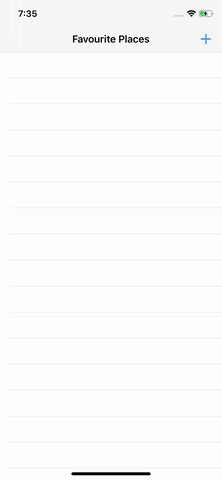
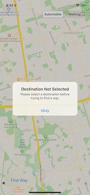

# To-Visit-Places-iOS
Advanced iOS Development Assignment 2. This is an iOS application, created as an Assignment. 
The Application builds upon the [MapView-App-iOS](https://github.com/chaitanyasanoriya/MapView-App-iOS) Application and add further features to it:
* Adding a first screen that will show all the Favourite Places
* Ability to delete a Favourite Place by Swipping
* Saving the Annotated place to Favourite Places
* Adding a Callout Accessory to the annotation
* Saving the Favourite Places persitently using User Defaults
* Editing the Favourite Place by dragging the pin / Annotation
* Ability to see and edit Favourite Place in Map View

  
Favourite Places First Screen:
 

  
Deleting a Favourite Place:
 

&emsp;&emsp;

  
Saving the Annotated place to Favourite Places:
 

  
Editing the Favourite Place by dragging the pin / Annotation:
 

&emsp;&emsp;

  
Ability to see and edit Favourite Place in Map View:
 

&emsp;&emsp;

&emsp;&emsp;

  
Showing Directions to Favourite Places:
 

&emsp;&emsp;

  
Showing Zoom in and Zoom out hint on first app run:
 

  
Showing Alert when error occurred:
 

